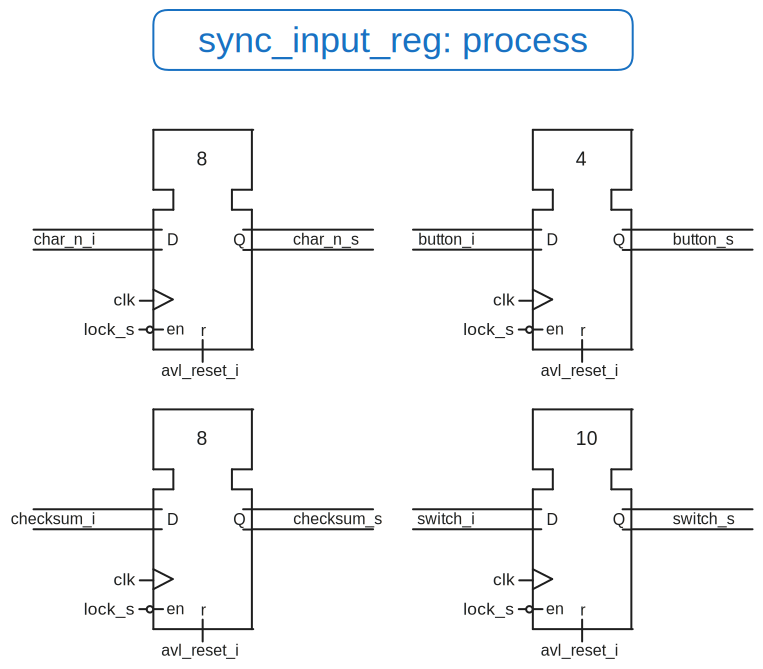
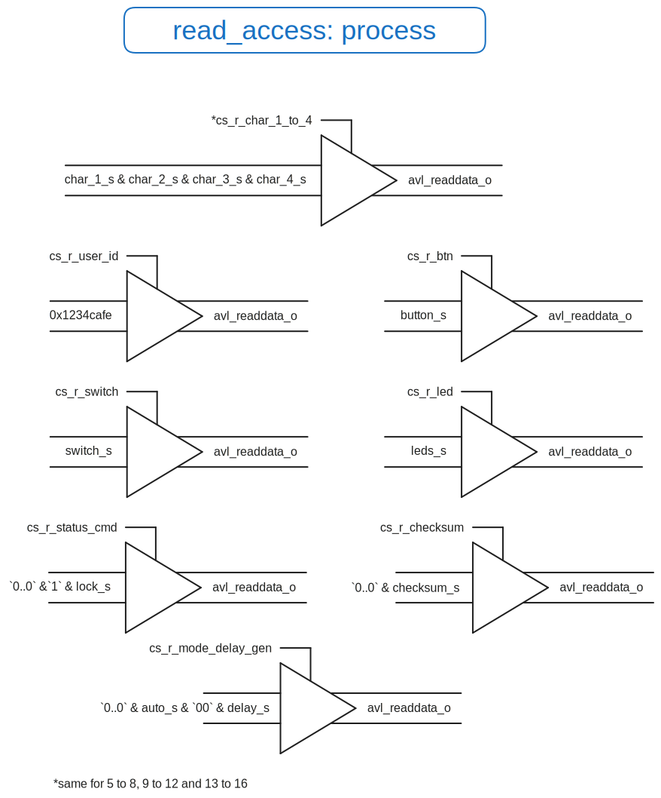
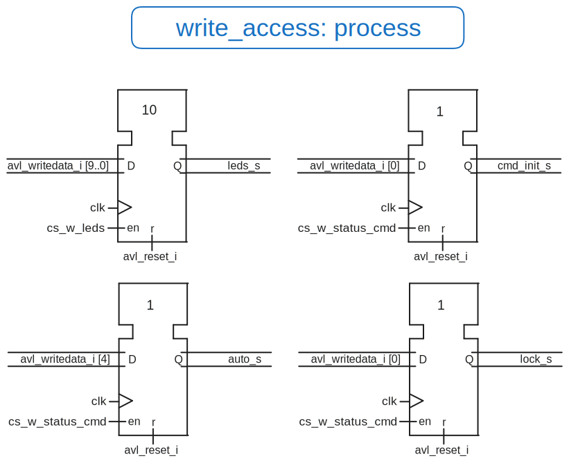

# <center> Laboratoire n°05 {ignore=true}

# <center> Conception d’interface fiable {ignore=true}

## <center>Département : TIC {ignore=true}

## <center>unité d’enseignement ARE {ignore=true}

<br>
<br>
<br>
<br>
<br>
<br>
<br>
<br>
<br>
<br>
<br>
<br>
<br>
<br>

Auteur: **Colin Jaques & Alexandre Iorio**

Professeur: **Etienne Messerli**

Assistant : **Anthony Converse**

Salle de labo : **A07**

Date : **13.12.2024**


<!--pagebreak-->

## <center>Table des matières {ignore=true}


<!-- @import "[TOC]" {cmd="toc" depthFrom=1 depthTo=6 orderedList=false} -->

<!-- code_chunk_output -->

- [0. Introduction](#0-introduction)
- [1. Partie 1 - Mise en place de l'interface de lecture](#1-partie-1---mise-en-place-de-linterface-de-lecture)
- [2. Plan d'adressage](#2-plan-dadressage)
- [3. Decodeur d'adresse](#3-decodeur-dadresse)
- [4. Schema des composants de l'interface fiable](#4-schema-des-composants-de-linterface-fiable)

<!-- /code_chunk_output -->

<!-- pagebreak -->


## 0. Introduction


Ce laboratoire à pour but de creer un interface permettant la lecture d'une chaine de caractère depuis un générateur.
Dans un premier temps, nous allons simplement lire les chaines de caractères et les afficher dans la console. Nous ferons une analyse du fonctionnement de l'interface et des problèmes rencontrés.
Puis nous modifierons l'interface afin de corriger les problèmes d'integrité des données. 

## 1. Partie 1 - Mise en place de l'interface de lecture

Dans cette partie, nous avons réalisé la description VHDL permettant de lire les données en provenance du générateur de chaine de caractères. Le principe est simple, les entrées sont simplement reportées sur le le bus Avalon lors de demande de lecture de la part du `CPU`

Pour se faire, nous avons reporté le plan d'adressage indiqué dans la donnée du laboratoire. 

| Adresse (offset)  | **Read**                                                                                | **Write**                                                                       |
| ----------------- | --------------------------------------------------------------------------------------- | ------------------------------------------------------------------------------- |
| `0x00`            | `[31..0]` Interface user ID                                                             | reserved                                                                        |
| `0x04`            | `[31..4]` "0..0" ; `[3..0]` buttons                                                     | reserved                                                                        |
| `0x08`            | `[31..10]` "0..0" ; `[9..0]` switchs                                                    | reserved                                                                        |
| `0x0C`            | `[31..10]` "0..0" ; `[9..0]` leds                                                       | `[31..10]` reserved ; `[9..0]` leds                                             |
| `0x10`            | `[31..2]` "0..0" ; `[1..0]` status                                                      | `[31..5]` reserved ; `[4]` new_char <br> `[3..1]` reserved ; `[0]` init_char    |
| `0x14`            | `[31..5]` "0..0" ; `[4]` mode_gen <br> `[3..2]` "0..0" ; `[1..0]` delay_gen             | `[31..5]` reserved ; `[4]` mode_gen <br> `[3..2]` reserved ; `[1..0]` delay_gen |
| `0x18`            | available for news functionality                                                        | available for news functionality                                                |
| `0x1C`            | available for news functionality                                                        | available for news functionality                                                |
| `0x20`            | `[31..24]` char_1 <br> `[23..16]` char_2 <br> `[15..8]` char_3 <br> `[7..0]` char_4     | reserved                                                                        |
| `0x24`            | `[31..24]` char_5 <br> `[23..16]` char_6 <br> `[15..8]` char_7 <br> `[7..0]` char_8     | reserved                                                                        |
| `0x28`            | `[31..24]` char_9 <br> `[23..16]` char_10 <br> `[15..8]` char_11 <br> `[7..0]` char_12  | reserved                                                                        |
| `0x2C`            | `[31..24]` char_13 <br> `[23..16]` char_14 <br> `[15..8]` char_15 <br> `[7..0]` char_16 | reserved                                                                        |
| `0x30`            | `[31..8]` "0..0" <br> `[7..0]` checksum                                                 | reserved                                                                        |
| `0x34` … `0x3C`   | reserved                                                                                | reserved                                                                        |
| `0x40` … `0xFFFC` | not used                                                                                | not used                                                                        |

```vhdl

```

## 2. Plan d'adressage

Le plan d'adressage nous a été donné et nous l'avons adapté afin de rajouter les éléments necessaires pour garantir une interface fiable.

| Adresse (offset)  | **Read**                                                                                | **Write**                                                                       |
| ----------------- | --------------------------------------------------------------------------------------- | ------------------------------------------------------------------------------- |
| `0x00`            | `[31..0]` Interface user ID                                                             | reserved                                                                        |
| `0x04`            | `[31..4]` "0..0" ; `[3..0]` buttons                                                     | reserved                                                                        |
| `0x08`            | `[31..10]` "0..0" ; `[9..0]` switchs                                                    | reserved                                                                        |
| `0x0C`            | `[31..10]` "0..0" ; `[9..0]` leds                                                       | `[31..10]` reserved ; `[9..0]` leds                                             |
| `0x10`            | `[31..2]` "0..0" ; `[1..0]` status                                                      | `[31..5]` reserved ; `[4]` new_char <br> `[3..1]` reserved ; `[0]` init_char    |
| `0x14`            | `[31..5]` "0..0" ; `[4]` mode_gen <br> `[3..2]` "0..0" ; `[1..0]` delay_gen             | `[31..5]` reserved ; `[4]` mode_gen <br> `[3..2]` reserved ; `[1..0]` delay_gen |
| `0x18`            | available for news functionality                                                        | **Part 2** `[31..1]` reserved; `[0]`Lock                                        |
| `0x1C`            | available for news functionality                                                        | available for news functionality                                                |
| `0x20`            | `[31..24]` char_1 <br> `[23..16]` char_2 <br> `[15..8]` char_3 <br> `[7..0]` char_4     | reserved                                                                        |
| `0x24`            | `[31..24]` char_5 <br> `[23..16]` char_6 <br> `[15..8]` char_7 <br> `[7..0]` char_8     | reserved                                                                        |
| `0x28`            | `[31..24]` char_9 <br> `[23..16]` char_10 <br> `[15..8]` char_11 <br> `[7..0]` char_12  | reserved                                                                        |
| `0x2C`            | `[31..24]` char_13 <br> `[23..16]` char_14 <br> `[15..8]` char_15 <br> `[7..0]` char_16 | reserved                                                                        |
| `0x30`            | `[31..8]` "0..0" <br> `[7..0]` checksum                                                 | reserved                                                                        |
| `0x34` … `0x3C`   | reserved                                                                                | reserved                                                                        |
| `0x40` … `0xFFFC` | not used                                                                                | not used                                                                        |

**Description des adresses en fonction du VHDL**

| Adresse CPU | Adresse Avalon | Nom constant          | Description                                                           | Accès            |
| :---------: | :------------: | --------------------- | --------------------------------------------------------------------- | ---------------- |
|    0x00     |      0x00      | `USER_ID_ADDR       ` | Identifiant utilisateur (USER_ID)                                     | Lecture          |
|    0x04     |      0x01      | `BTN_ADDR           ` | Boutons (button_i)                                                    | Lecture          |
|    0x08     |      0x02      | `SWITCH_ADDR        ` | Interrupteurs (switch_i)                                              | Lecture          |
|    0x0C     |      0x03      | `LED_ADDR           ` | LEDs (led_o)                                                          | Lecture/Écriture |
|    0x10     |      0x04      | `STATUS_CMD_ADDR    ` | Statut et commandes : <br>- [0] cmd_init_o  <br> - [4] cmd_new_char_o | Lecture/Écriture |
|    0x14     |      0x05      | `MODE_DELAY_GEN_ADDR` | Mode et délai : <br> - [4] auto_o <br> - [1:0] delay_o                | Lecture/Écriture |
|    0x18     |      0x06      | `LOCK_ADDR          ` | Verrouillage des caractères (lock_s)                                  | Écriture         |
|    0x1C     |      0x07      | `RESERVED           ` | Réservé                                                               | -                |
|    0x20     |      0x08      | `CHAR_1_TO_4_ADDR   ` | Caractères 1 à 4 (char_1_i à char_4_i)                                | Lecture          |
|    0x24     |      0x09      | `CHAR_5_TO_8_ADDR   ` | Caractères 5 à 8 (char_5_i à char_8_i)                                | Lecture          |
|    0x28     |      0x0A      | `CHAR_9_TO_12_ADDR  ` | Caractères 9 à 12 (char_9_i à char_12_i)                              | Lecture          |
|    0x2C     |      0x0B      | `CHAR_13_TO_16_ADDR ` | Caractères 13 à 16 (char_13_i à char_16_i)                            | Lecture          |
|    0x30     |      0x0C      | `CHECKSUM_ADDR      ` | Somme de contrôle (checksum_i)                                        | Lecture          |


## 3. Decodeur d'adresse

Afin de faire lien entre entre le plan d'adressage et le schema, voici les équations de décodage des adresses.

```vhdl
we assume that avl_read_i and avl_write_i are not set at the same time

cs_r_user_id        = (avl_address_i = USER_ID_ADDR) AND (avl_read_i = '1')
cs_r_btn            = (avl_address_i = BTN_ADDR) AND (avl_read_i = '1')
cs_r_switch         = (avl_address_i = SWITCH_ADDR) AND (avl_read_i = '1')
cs_r_led            = (avl_address_i = LED_ADDR) AND (avl_read_i = '1')
cs_r_status_cmd     = (avl_address_i = STATUS_CMD_ADDR) AND (avl_read_i = '1')
cs_r_mode_delay_gen = (avl_address_i = MODE_DELAY_GEN_ADDR) AND (avl_read_i = '1')
cs_r_char_1_to_4    = (avl_address_i = CHAR_1_TO_4_ADDR) AND (avl_read_i = '1')
cs_r_char_5_to_8    = (avl_address_i = CHAR_5_TO_8_ADDR) AND (avl_read_i = '1')
cs_r_char_9_to_12   = (avl_address_i = CHAR_9_TO_12_ADDR) AND (avl_read_i = '1')
cs_r_char_13_to_16  = (avl_address_i = CHAR_13_TO_16_ADDR) AND (avl_read_i = '1')
cs_r_checksum       = (avl_address_i = CHECKSUM_ADDR) AND (avl_read_i = '1')
cs_w_leds           = (avl_address_i = LED_ADDR) AND (avl_write_i = '1')
cs_w_status_cmd     = (avl_address_i = STATUS_CMD_ADDR) AND (avl_write_i = '1')
cs_w_mode_delay_gen = (avl_address_i = MODE_DELAY_GEN_ADDR) AND (avl_write_i = '1')
cs_w_lock           = (avl_address_i = LOCK_ADDR) AND (avl_write_i = '1')
``` 

## 4. Schema des composants de l'interface fiable


Dans un premier temps, nous avons du synchroniser les entrées en provenance du périphérique `DE1-SoC` ainsi que le générateur de chaine de charactères, à savoir:


- `button_i`
- `switch_i`
- `char_1` à `char_16`

Voici le schéma desquels le vhdl a été implémenté:



Puis nous avons du créer un module permettant de lire les données en provenance du générateur de chaine de caractères pour les retransmettre sur le bus avalon



Enfin, nous avons du créer un module permettant d'écrire les données en provenance du bus avalon. 
Cela nous permet de commander le générateur de chaine de caractères.




