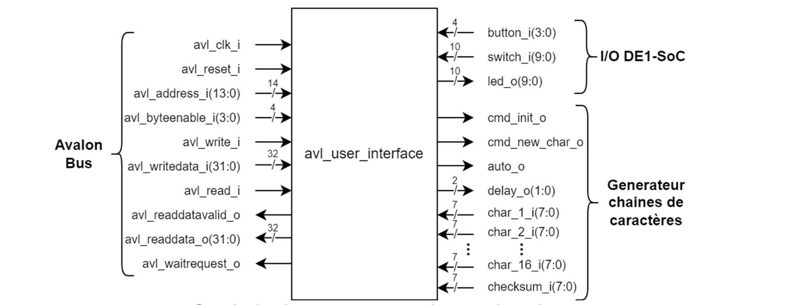
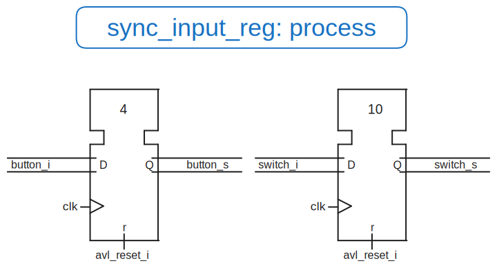
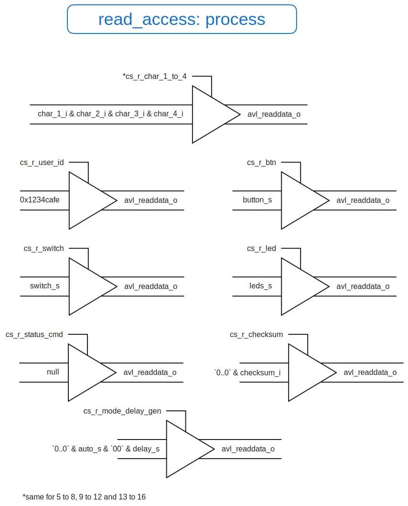
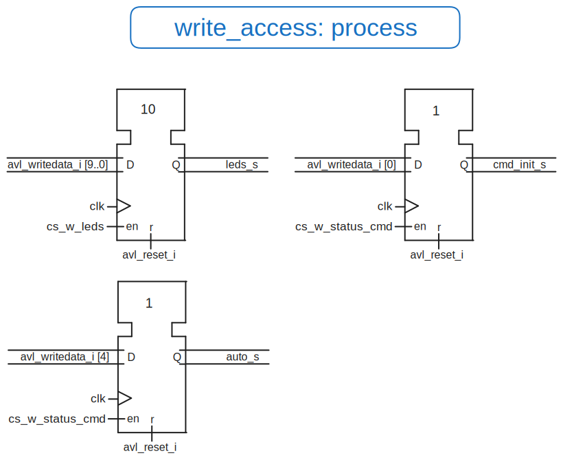
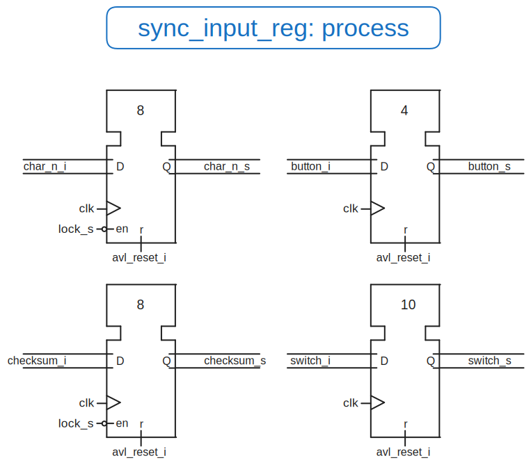
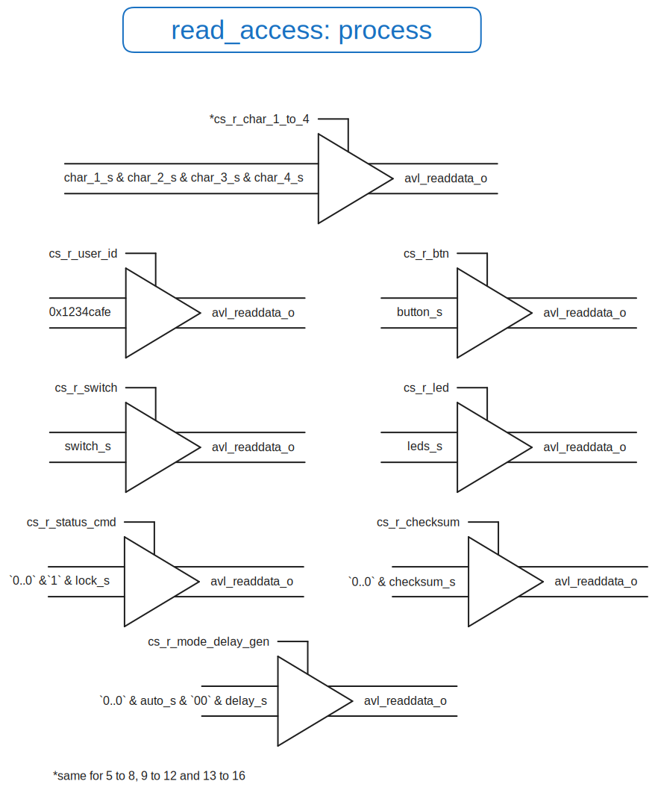
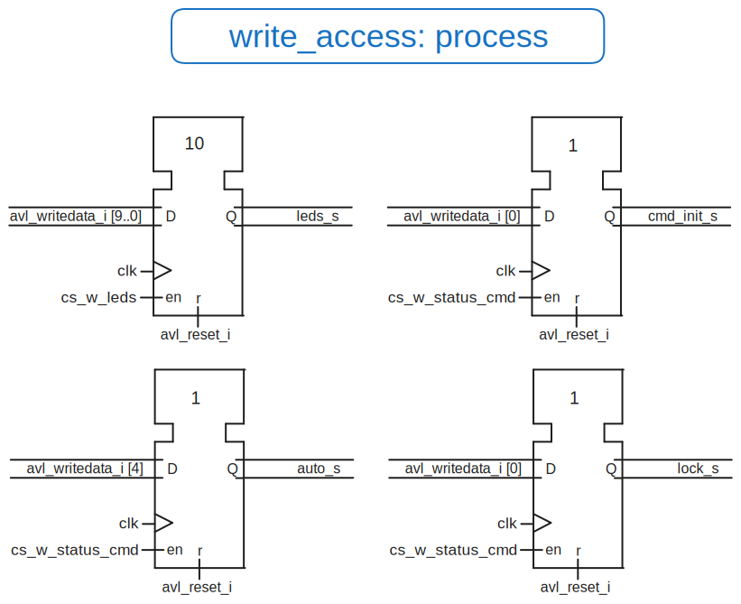

# <center> Laboratoire n°05 {ignore=true}

# <center> Conception d’interface fiable {ignore=true}

## <center>Département : TIC {ignore=true}

## <center>unité d’enseignement ARE {ignore=true}

<br>
<br>
<br>
<br>
<br>
<br>
<br>
<br>
<br>
<br>
<br>
<br>
<br>
<br>

Auteur: **Colin Jaques & Alexandre Iorio**

Professeur: **Etienne Messerli**

Assistant : **Anthony Converse**

Salle de labo : **A07**

Date : **13.12.2024**


<!--pagebreak-->

## <center>Table des matières {ignore=true}

<!-- @import "[TOC]" {cmd="toc" depthFrom=1 depthTo=6 orderedList=false} -->

<!-- code_chunk_output -->

- [0. Introduction](#0-introduction)
- [1. Partie 1 - Mise en place de l'interface de manière non fiable](#1-partie-1---mise-en-place-de-linterface-de-manière-non-fiable)
  - [1.1. Description des constantes et signaux](#11-description-des-constantes-et-signaux)
  - [1.2. Description des processus](#12-description-des-processus)
    - [1.2.1. Synchronisation des entrées](#121-synchronisation-des-entrées)
    - [1.2.2. Lecture des données](#122-lecture-des-données)
    - [1.2.3. Ecriture des données](#123-ecriture-des-données)
  - [1.3. Developpement de la partie logiciel](#13-developpement-de-la-partie-logiciel)
    - [**Fonctionnement détaillé :**](#fonctionnement-détaillé-)
    - [**Code détaillé :**](#code-détaillé-)
    - [**Formule utilisée pour vérifier l'intégrité :**](#formule-utilisée-pour-vérifier-lintégrité-)
    - [**Affichage des résultats :**](#affichage-des-résultats-)

<!-- /code_chunk_output -->

<!-- pagebreak -->


## 0. Introduction

Ce laboratoire a pour but de créer une interface permettant la lecture d'une chaine de caractère depuis un générateur.
Dans un premier temps, nous allons simplement lire les chaines de caractères et les afficher dans la console. Nous ferons une analyse du fonctionnement de l'interface et des problèmes rencontrés.
Puis nous modifierons l'interface afin de corriger les problèmes d'intégrité des données. 

## 1. Partie 1 - Mise en place de l'interface de manière non fiable

Dans cette partie, nous avons réalisé la description VHDL permettant de lire les données en provenance du générateur de chaine de caractères. Le principe est simple, les entrées sont simplement reportées sur le bus Avalon lors de demande de lecture de la part du `CPU`

### 1.1. Description des constantes et signaux

Afin de réaliser cette partie, nous devons dans un premier temps définir les constants et les signaux suivants:

```vhdl
    --| Constants declarations |--------------------------------------------------------------
    
    constant USER_ID            : std_logic_vector(avl_readdata_o'range):= x"1234cafe";
    constant BAD_ADDRESS_VAL    : std_logic_vector(avl_readdata_o'range):= x"badcaffe";
    constant USER_ID_ADDR       : std_logic_vector(13 downto 0):= "00" & x"000";
    constant BTN_ADDR           : std_logic_vector(13 downto 0):= "00" & x"001";
    constant SWITCH_ADDR        : std_logic_vector(13 downto 0):= "00" & x"002";
    constant LED_ADDR           : std_logic_vector(13 downto 0):= "00" & x"003";
    constant STATUS_CMD_ADDR    : std_logic_vector(13 downto 0):= "00" & x"004";
    constant MODE_DELAY_GEN_ADDR: std_logic_vector(13 downto 0):= "00" & x"005";
    constant RESERVED_1_ADDR    : std_logic_vector(13 downto 0):= "00" & x"006";
    constant RESERVED_2_ADDR    : std_logic_vector(13 downto 0):= "00" & x"007";
    constant CHAR_1_TO_4_ADDR   : std_logic_vector(13 downto 0):= "00" & x"008";
    constant CHAR_5_TO_8_ADDR   : std_logic_vector(13 downto 0):= "00" & x"009";
    constant CHAR_9_TO_12_ADDR  : std_logic_vector(13 downto 0):= "00" & x"00A";
    constant CHAR_13_TO_16_ADDR : std_logic_vector(13 downto 0):= "00" & x"00B";
    constant CHECKSUM_ADDR      : std_logic_vector(13 downto 0):= "00" & x"00C";

    --| Signals declarations   |--------------------------------------------------------------   
    -- Inputs signals 
    ---- I/O DE1-SoC
    signal button_s          : std_logic_vector(3 downto 0);
    signal switch_s          : std_logic_vector(9 downto 0);

    -- Outputs signals
    ---- I/O DE1-SoC
    signal leds_s            : std_logic_vector(9 downto 0);

    ---- Gen strings
    signal auto_s            : std_logic;
    signal delay_s           : std_logic_vector(1 downto 0);
    signal cmd_init_s        : std_logic;
    signal cmd_new_char_s    : std_logic;
```

### 1.2. Description des processus

Maintenant que nous connaissons les constantes et les signaux, nous allons établir la description `VHDL` ainsi que les schémas permettant de répondre au schéma bloc suivant:



Pour ce faire, nous devons prendre en compte le plan d'adressage suivant:

| Adresse (offset)  | **Read**                                                                                | **Write**                                                                       |
|-------------------|-----------------------------------------------------------------------------------------|---------------------------------------------------------------------------------|
| `0x00`            | `[31..0]` Interface user ID                                                             | reserved                                                                        |
| `0x04`            | `[31..4]` "0..0" ; `[3..0]` buttons                                                     | reserved                                                                        |
| `0x08`            | `[31..10]` "0..0" ; `[9..0]` switchs                                                    | reserved                                                                        |
| `0x0C`            | `[31..10]` "0..0" ; `[9..0]` leds                                                       | `[31..10]` reserved ; `[9..0]` leds                                             |
| `0x10`            | `[31..2]` "0..0" ; `[1..0]` status                                                      | `[31..5]` reserved ; `[4]` new_char <br> `[3..1]` reserved ; `[0]` init_char    |
| `0x14`            | `[31..5]` "0..0" ; `[4]` mode_gen <br> `[3..2]` "0..0" ; `[1..0]` delay_gen             | `[31..5]` reserved ; `[4]` mode_gen <br> `[3..2]` reserved ; `[1..0]` delay_gen |
| `0x18`            | available for news functionality                                                        | available for news functionality                                                |
| `0x1C`            | available for news functionality                                                        | available for news functionality                                                |
| `0x20`            | `[31..24]` char_1 <br> `[23..16]` char_2 <br> `[15..8]` char_3 <br> `[7..0]` char_4     | reserved                                                                        |
| `0x24`            | `[31..24]` char_5 <br> `[23..16]` char_6 <br> `[15..8]` char_7 <br> `[7..0]` char_8     | reserved                                                                        |
| `0x28`            | `[31..24]` char_9 <br> `[23..16]` char_10 <br> `[15..8]` char_11 <br> `[7..0]` char_12  | reserved                                                                        |
| `0x2C`            | `[31..24]` char_13 <br> `[23..16]` char_14 <br> `[15..8]` char_15 <br> `[7..0]` char_16 | reserved                                                                        |
| `0x30`            | `[31..8]` "0..0" <br> `[7..0]` checksum                                                 | reserved                                                                        |
| `0x34` … `0x3C`   | reserved                                                                                | reserved                                                                        |
| `0x40` … `0xFFFC` | not used                                                                                | not used                                                                        |


Maintenant que nous avons tous les éléments à disposition, nous allons établir les descriptions VHDL des processus ainsi que les schemas permettant d'atteindre l'objectif de la partie 1.

#### 1.2.1. Synchronisation des entrées

Pour ce faire il est nécessaire de synchroniser les entrées en provenance du périphérique `DE1-SoC`, à savoir:

- `button_i`
- `switch_i`

Voici le schéma duquel le vhdl a été implémenté:



```vhdl
 -- sync input part
    sync_input_reg: process (avl_clk_i, avl_reset_i)
        begin
            if avl_reset_i = '1' then
                button_s <= (others => '0');
                switch_s <= (others => '0');
            elsif rising_edge(avl_clk_i) then
                button_s <= button_i;
                switch_s <= switch_i;
           end if;
        end process;
``` 

#### 1.2.2. Lecture des données

Puis nous avons du créer un module permettant de lire les données en provenance du générateur de chaine de caractères pour les retransmettre sur le bus Avalon




```vhdl
 -- Read access part 
    read_access: process(avl_clk_i, avl_reset_i)
        begin
            if avl_reset_i = '1' then
                avl_readdata_o <= (others => '0');
                avl_readdatavalid_o <= '0';
            elsif rising_edge(avl_clk_i) then
                avl_readdatavalid_o <= avl_read_i;
                if avl_read_i = '1' then 
                    avl_readdata_o <= (others => '0');
                    case avl_address_i is
                        when USER_ID_ADDR       => avl_readdata_o <= USER_ID;
                        when BTN_ADDR           => avl_readdata_o(button_s'range)<= button_s;
                        when SWITCH_ADDR        => avl_readdata_o(switch_s'range)<= switch_s;
                        when LED_ADDR           => avl_readdata_o(leds_s'range)<= leds_s;
                        when STATUS_CMD_ADDR    => null;
                        when MODE_DELAY_GEN_ADDR=> avl_readdata_o(31 downto 0) <= (31 downto 5 => '0') & auto_s & (3 downto 2 => '0') & delay_s(delay_s'range);
                        when CHAR_1_TO_4_ADDR   => avl_readdata_o(31 downto 0) <= char_1_i & char_2_i & char_3_i & char_4_i;
                        when CHAR_5_TO_8_ADDR   => avl_readdata_o(31 downto 0) <= char_5_i & char_6_i & char_7_i & char_8_i;
                        when CHAR_9_TO_12_ADDR  => avl_readdata_o(31 downto 0) <= char_9_i & char_10_i & char_11_i & char_12_i;
                        when CHAR_13_TO_16_ADDR => avl_readdata_o(31 downto 0) <= char_13_i & char_14_i & char_15_i & char_16_i;
                        when CHECKSUM_ADDR      => avl_readdata_o(checksum_i'range) <= checksum_i;
                        when others             => avl_readdata_o <= BAD_ADDRESS_VAL;
                    end case;
                end if;
            end if;
        end process;

```
#### 1.2.3. Ecriture des données

Enfin, nous avons du créer un module permettant d'écrire les données en provenance du bus Avalon. 
Cela nous permet de commander le générateur de chaine de caractères.



```vhdl
-- Write access part
write_access: process(avl_clk_i, avl_reset_i)
    begin
        -- Default values
        if avl_reset_i = '1' then
            leds_s <= (others => '0'); 
        elsif rising_edge(avl_clk_i) then
            cmd_new_char_s <= '0';
            if avl_write_i = '1' then 
                case avl_address_i is
                    when LED_ADDR       => leds_s <= avl_writedata_i(leds_s'range);
                    when STATUS_CMD_ADDR  => 
                        cmd_init_s <= avl_writedata_i(0);
                        cmd_new_char_s <= avl_writedata_i(4);
                    when MODE_DELAY_GEN_ADDR =>
                        delay_s <= avl_writedata_i(delay_s'range);
                        auto_s <= avl_writedata_i(4);
                    when others => null;
                end case;
            end if;
        end if;
    end process;
```

### 1.3. Developpement de la partie logiciel

Pour le développement de la partie logiciel du projet nous avons séparé le code en 3 partie.

Une première partie permet de communiquer avec les différents interfaces standards de la carte DE1-SoC. Cette partie se trouve dans le fichier `interface_function.h`.
Ce fichier permet de :

- Lire les boutons
- Lire les switchs
- Manipuler les leds

Etant donné que ces fonctions ont déjà été implémentée dans les laboratoires précédents, nous ne reviendrons pas dessus.

Concernant la deuxième partie, elle permet de communiquer et de manipuler l'interface de génération de string. Cette partie se trouve dans le fichier `char_gen.h`.
Ce fichier permet de :

- Initialiser le générateur de chaine de caractères
- Changer le mode de génération ( automatique / manuel )
- Connaître le mode actuel
- Changer le délai de génération
- Connaître le délai actuel
- Générer une nouvelle chaine de caractère (en mode manuel)
- Récupèrer le checksum
- Récuperer la chaîne complète et calculer le checksum afin de le comparer avec celui reçu dans le but de vérifier l'intégrité des données

Les premières fonctions étant relativement triviale, seule les fonctions de lecture de la chaine de caractère et de vérification de l'intégrité des données seront expliquées.

La fonction principale développée pour ce laboratoire est `calculate_integrity_bulk`. Elle permet de lire les 16 caractères générés par le périphérique FPGA, d'effectuer un calcul d'intégrité avec le checksum fourni, et de vérifier si les données sont cohérentes. Cette fonction est essentielle pour valider le bon fonctionnement de l'interface.

#### **Fonctionnement détaillé :**

1. **Lecture des caractères :**  
   La fonction lit les 16 caractères générés, regroupés en 4 blocs de 4 caractères (32 bits chacun). Chaque caractère est extrait à l'aide d'un décalage binaire, puis ajouté à une somme pour préparer le calcul d'intégrité.

2. **Calcul du checksum :**  
   Le checksum est récupéré directement à partir du registre dédié (`get_checksum()`), puis ajouté à la somme totale des caractères.

3. **Vérification d'intégrité :**  
   Le calcul d'intégrité repose sur l'équation suivante, qui doit être respectée à tout moment :
   \[
   \text{(char}_1 + \text{char}_2 + \ldots + \text{char}_{16} + \text{checksum)} \mod 256 = 0
   \]
   - Si le résultat est **0**, l'intégrité est correcte, et un message de confirmation est affiché avec la chaîne de caractères.
   - Sinon, un message d'erreur est affiché, et un compteur persistant incrémente le nombre total d'erreurs détectées.

4. **Mode fiable désactivé :**  
   Aucune mesure n'est prise pour verrouiller l'acquisition, ce qui peut entraîner des erreurs d'intégrité si les données changent entre les lectures.

#### **Code détaillé :**

```c
void calculate_integrity_bulk() {

    uint8_t checksum = get_checksum(); // Récupère le checksum du périphérique
    uint32_t sum = 0;
    uint32_t checksum_computed = 0;
    char str[17] = { 0 }; // Buffer pour les 16 caractères générés

    // Lecture des 16 caractères en groupes de 4
    for (int i = 0; i < 4; i++) {
        uint32_t group = get_4_char(i); // Lit un bloc de 4 caractères
        for (int j = 0; j < 4; j++) {
            char c = (group >> (8 * (3 - j))) & 0xFF; // Extrait un caractère
            sum += c; // Ajoute à la somme
            str[i * 4 + j] = c; // Stocke dans le buffer
        }
    }

    // Calcul de l'intégrité
    checksum_computed = (sum + checksum) % 256;

    // Vérification et affichage
    if (checksum_computed == 0) {
        printf("OK: checksum: 0x%02X, calculated: 0x%02X, string: %s\n",
               checksum, sum % 256, str);
    } else {
        static uint32_t error_count = 0; // Compteur d'erreurs persistant
        error_count++;
        printf("ER: checksum: 0x%02X, calculated: 0x%02X, string: %s\n",
               checksum, sum, str);
        printf("ER: error count: %d\n", error_count);
    }
}
```

#### **Formule utilisée pour vérifier l'intégrité :**
Le calcul du checksum est basé sur la somme des caractères ASCII générés et du checksum reçu. L'intégrité est valide si la condition suivante est respectée :
\[
\text{(Somme des caractères + checksum)} \mod 256 = 0
\]

- Cette propriété est utilisée pour détecter des erreurs de transmission ou de synchronisation des données.

#### **Affichage des résultats :**
- **Message OK :**  
  Si l'intégrité est correcte, la console affiche un message avec le checksum attendu, la somme calculée, et la chaîne complète :
  ```
  OK: checksum: 0xXX, calculated: 0xXX, string: XXXXXXXXXXXXXXXX
  ```
- **Message d'erreur :**  
  En cas d'erreur, un compteur d'erreurs est incrémenté, et les détails de l'anomalie sont affichés :
  ```
  ER: checksum: 0xXX, calculated: 0xXX, string: XXXXXXXXXXXXXXXX
  ER: error count: X
  ```

  ### Application de test

  Pour tester l'application et afin de répondre aux exigeances du laboratoire, nous avons réalisé une application permettant de tester l'interface. Cette application à la même structure que celle réalisée pour les laboratoires précédents. Nous appelons simplement la fonction `calculate_integrity_bulk` à chaque itération de la boucle principale lorsque le bouton correspondant à la lecture des données est pressé.

  ```c

### 1.4. Analyse des résultats

Nous avons maintenant un système fonctionnel permettant de lire les données en provenance du générateur de chaine de caractères. Nous avons pu constater que les données étaient bien transmises et que le système fonctionnait partiellement. 

//TODO: Output de la console

En effet, la simple transmission des entrées du générateur de chaines de caractères vers le bus avalon ne permet pas de garantir l'intégrité des données.

Lors d'une transmission de chaine de caractère a une fréquence moins élevé que la fréquence de lecture, les chaines de caractères sont, dans la majeure partie des cas, bien transmises. Cependant, lors d'une transmission de chaine de caractère à une fréquence plus élevée que la fréquence de lecture, les chaines de caractères sont tronquées.

En raison de la faible vitesse de lecture du `CPU`, la `FPGA` écrit les données trop rapidement pour que le `CPU` puisse lire les 16 caractères avant que la chaine de caractère suivante ne soit réécrite.

De cette analyse, nous pouvons conclure que l'intégrité des données n'est pas garantie, et ce, même à basse fréquence. 

Il nous faut donc trouver une solution pour garantir l'intégrité des données. Cela introduit donc la partie 2 de ce laboratoire.

## 2. Partie 2 - Mise en place de l'interface de manière fiable

Le problème rencontré dans la partie 1 étant connu, nous allons maintenant mettre en place une interface fiable permettant de garantir l'intégrité des données. Pour ce faire, il serait idéal de bloquer l'écriture des données provenant du générateur de chaine de caractères tant que le `CPU` n'a pas terminé la lecture des données précédentes. Nous avons décidé de simplement offrir la possibilité au cpu de bloquer l'écriture des données provenant du générateur de chaine de caractères à l'aide d'un bit. Cela permettra de garantir l'intégrité des données et de choisir depuis le CPU si l'on souhaite bloquer ou non l'écriture des données.

Nous avons décidé de ne pas contrôler qu'un nouvel instantané soit disponible lors de la lecture. En effet, grâce à notre implémentation, lorsque le cpu a bloqué l'écriture des données, il peut lire les données précédentes sans problème sans avoir à contrôler qu'un nouvel instantané soit disponible.

Nous pouvons donc intégrer un principe de verrouillage des données.

### 2.1. Description des constantes et signaux

Pour cela, nous ajoutons une constante permettant de définir l'adresse du bit de verrouillage.

```vhdl
    constant LOCK_ADDR          : std_logic_vector(13 downto 0):= "00" & x"006";
```

puis nous ajoutons les signaux permettant de sauvegarder l'état de la chaine de caractères.

```vhdl
    signal char_1_s    :   std_logic_vector(7 downto 0);
    signal char_2_s    :   std_logic_vector(7 downto 0);
    signal char_3_s    :   std_logic_vector(7 downto 0);
    signal char_4_s    :   std_logic_vector(7 downto 0);
    signal char_5_s    :   std_logic_vector(7 downto 0);
    signal char_6_s    :   std_logic_vector(7 downto 0);
    signal char_7_s    :   std_logic_vector(7 downto 0);
    signal char_8_s    :   std_logic_vector(7 downto 0);
    signal char_9_s    :   std_logic_vector(7 downto 0);
    signal char_10_s   :   std_logic_vector(7 downto 0);
    signal char_11_s   :   std_logic_vector(7 downto 0);
    signal char_12_s   :   std_logic_vector(7 downto 0);
    signal char_13_s   :   std_logic_vector(7 downto 0);
    signal char_14_s   :   std_logic_vector(7 downto 0);
    signal char_15_s   :   std_logic_vector(7 downto 0);
    signal char_16_s   :   std_logic_vector(7 downto 0);
    signal checksum_s  :   std_logic_vector(7 downto 0);
```

### 2.2. Description des processus

Comme nous avons un espace d'adressage disponible à l'adresse `0x18` nous allons l'utiliser pour écrire un bit de verrouillage, que nous nommerons `lock`.

| Adresse (offset)  | **Read**                                                                                | **Write**                                                                       |
|-------------------|-----------------------------------------------------------------------------------------|---------------------------------------------------------------------------------|
| `0x00`            | `[31..0]` Interface user ID                                                             | reserved                                                                        |
| `0x04`            | `[31..4]` "0..0" ; `[3..0]` buttons                                                     | reserved                                                                        |
| `0x08`            | `[31..10]` "0..0" ; `[9..0]` switchs                                                    | reserved                                                                        |
| `0x0C`            | `[31..10]` "0..0" ; `[9..0]` leds                                                       | `[31..10]` reserved ; `[9..0]` leds                                             |
| `0x10`            | `[31..2]` "0..0" ; `[1..0]` status                                                      | `[31..5]` reserved ; `[4]` new_char <br> `[3..1]` reserved ; `[0]` init_char    |
| `0x14`            | `[31..5]` "0..0" ; `[4]` mode_gen <br> `[3..2]` "0..0" ; `[1..0]` delay_gen             | `[31..5]` reserved ; `[4]` mode_gen <br> `[3..2]` reserved ; `[1..0]` delay_gen |
| `0x18`            | available for news functionality                                                        | `[31..1]` reserved; **`[0]`Lock**                                               |
| `0x1C`            | available for news functionality                                                        | available for news functionality                                                |
| `0x20`            | `[31..24]` char_1 <br> `[23..16]` char_2 <br> `[15..8]` char_3 <br> `[7..0]` char_4     | reserved                                                                        |
| `0x24`            | `[31..24]` char_5 <br> `[23..16]` char_6 <br> `[15..8]` char_7 <br> `[7..0]` char_8     | reserved                                                                        |
| `0x28`            | `[31..24]` char_9 <br> `[23..16]` char_10 <br> `[15..8]` char_11 <br> `[7..0]` char_12  | reserved                                                                        |
| `0x2C`            | `[31..24]` char_13 <br> `[23..16]` char_14 <br> `[15..8]` char_15 <br> `[7..0]` char_16 | reserved                                                                        |
| `0x30`            | `[31..8]` "0..0" <br> `[7..0]` checksum                                                 | reserved                                                                        |
| `0x34` … `0x3C`   | reserved                                                                                | reserved                                                                        |
| `0x40` … `0xFFFC` | not used                                                                                | not used                                                                        |

Mainentant que nous avons un plan d'adressage complet, nous allons adapter les descriptions VHDL des processus ainsi que les schémas permettant d'atteindre l'objectif de la partie 2.


#### 2.2.1 Synchronisation des entrées

Comme pour la partie 1, nous devons synchroniser les entrées en provenance du périphérique `DE1-SoC` mais maintenant, nous allons aussi synchroniser les entrées en provenance du générateur de chaine de caractères.



Comme on peut le voir sur ce schéma, nous avons ajouté une condition de synchronisation pour les entrées en provenance du générateur de chaine de caractères grâce à un signal `lock_s` qui permettra de désactiver le registre de synchronisation.

```vhdl
 -- sync input part
    sync_input_reg: process (avl_clk_i, avl_reset_i)
        begin
            if avl_reset_i = '1' then
                button_s <= (others => '0');
                switch_s <= (others => '0');
		        char_1_s <= (others => '0');
                char_2_s <= (others => '0');
                char_3_s <= (others => '0');
                char_4_s <= (others => '0');
                char_5_s <= (others => '0');
                char_6_s <= (others => '0');
                char_7_s <= (others => '0');
                char_8_s <= (others => '0');
                char_9_s <= (others => '0');
                char_10_s <= (others => '0');
                char_11_s <= (others => '0');
                char_12_s <= (others => '0');
                char_13_s <= (others => '0');
                char_14_s <= (others => '0');
                char_15_s <= (others => '0');
                char_16_s <= (others => '0');
                checksum_s <= (others => '0');
            elsif rising_edge(avl_clk_i) then
                button_s <= button_i;
                switch_s <= switch_i;
                if lock_s = '0' then
                    char_1_s <= char_1_i;
                    char_2_s <= char_2_i;
                    char_3_s <= char_3_i;
                    char_4_s <= char_4_i;
                    char_5_s <= char_5_i;
                    char_6_s <= char_6_i;
                    char_7_s <= char_7_i;
                    char_8_s <= char_8_i;
                    char_9_s <= char_9_i;
                    char_10_s <= char_10_i;
                    char_11_s <= char_11_i;
                    char_12_s <= char_12_i;
                    char_13_s <= char_13_i;
                    char_14_s <= char_14_i;
                    char_15_s <= char_15_i;
                    char_16_s <= char_16_i;
                    checksum_s <= checksum_i;
                end if;
           end if;
        end process;
```

Nous pouvons maintenant passer à la lecture des données.

#### 2.2.2 Lecture des données

Puis, nous allons adapter le module permettant de lire les données en provenance du générateur de chaine de caractères pour les retransmettre sur le bus avalon de manière fiable.




```vhdl
  -- Read access part 
    read_access: process(avl_clk_i, avl_reset_i)
        begin
            if avl_reset_i = '1' then
                avl_readdata_o <= (others => '0');
                avl_readdatavalid_o <= '0';
            elsif rising_edge(avl_clk_i) then
                avl_readdatavalid_o <= avl_read_i;
                if avl_read_i = '1' then 
                    avl_readdata_o <= (others => '0');
                    case avl_address_i is
                        when USER_ID_ADDR       => avl_readdata_o <= USER_ID;
                        when BTN_ADDR           => avl_readdata_o(button_s'range)<= button_s;
                        when SWITCH_ADDR        => avl_readdata_o(switch_s'range)<= switch_s;
                        when LED_ADDR           => avl_readdata_o(leds_s'range)<= leds_s;
                        when STATUS_CMD_ADDR    => avl_readdata_o(1 downto 0) <= '1' & lock_s; 
                        when MODE_DELAY_GEN_ADDR=> avl_readdata_o(31 downto 0) <= (31 downto 5 => '0') & auto_s & (3 downto 2 => '0') & delay_s(delay_s'range);
                        when CHAR_1_TO_4_ADDR   => avl_readdata_o(31 downto 0) <= char_1_s & char_2_s & char_3_s & char_4_s;
                        when CHAR_5_TO_8_ADDR   => avl_readdata_o(31 downto 0) <= char_5_s & char_6_s & char_7_s & char_8_s;
                        when CHAR_9_TO_12_ADDR  => avl_readdata_o(31 downto 0) <= char_9_s & char_10_s & char_11_s & char_12_s;
                        when CHAR_13_TO_16_ADDR => avl_readdata_o(31 downto 0) <= char_13_s & char_14_s & char_15_s & char_16_s;
                        when CHECKSUM_ADDR      => avl_readdata_o(checksum_s'range) <= checksum_s;
                        when others             => avl_readdata_o <= BAD_ADDRESS_VAL;
                    end case;
                end if;
            end if;
        end process;
```

#### 2.2.3. Ecriture des données

Enfin, nous adaptons le module permettant d'écrire les données en provenance du bus Avalon. 




```vhdl
write_access: process(avl_clk_i, avl_reset_i)
        begin
            -- Default values
            if avl_reset_i = '1' then
                leds_s <= (others => '0'); 
    		lock_s <= '0';
            elsif rising_edge(avl_clk_i) then
                cmd_new_char_s <= '0';
                cmd_init_s <= '0';
                if avl_write_i = '1' then 
                    case avl_address_i is
                        when LED_ADDR       => leds_s <= avl_writedata_i(leds_s'range);
                        when STATUS_CMD_ADDR  => 
                            cmd_init_s <= avl_writedata_i(0);
                            cmd_new_char_s <= avl_writedata_i(4);
                        when MODE_DELAY_GEN_ADDR =>
                            delay_s <= avl_writedata_i(delay_s'range);
                            auto_s <= avl_writedata_i(4);
                        when LOCK_ADDR =>
                            lock_s <= avl_writedata_i(0);
                        when others => null;
                    end case;
                end if;
            end if;
        end process;
```

### 2.3. Adaptation de la partie logiciel

#### Modifications apportées pour gérer l'intégrité des données

Dans la partie logicielle, nous avons adapté la fonction `calculate_integrity_bulk` pour intégrer une gestion du verrouillage des données. Cette amélioration garantit que les données lues sont cohérentes, même si elles sont modifiées à une fréquence élevée par le générateur de chaînes de caractères. Voici les principaux changements et leur impact :

1. **Introduction du mode fiable avec verrouillage :**
   - La version sécurisée de la fonction utilise un bit de verrouillage (`LOCK_ADDR`) pour empêcher toute modification des données pendant leur lecture.
   - Avant de commencer à lire les données, la fonction active ce bit via le registre `CHAR_GEN_LOCK_READ_OFFSET`.
   - Une fois la lecture des données terminée, le bit est désactivé pour permettre au générateur de continuer son fonctionnement normal.

   **Code ajouté :**
   ```c
   if (mode) {
       INTERFACE_REG(CHAR_GEN_LOCK_READ_OFFSET) = 1; // Active le verrou
   }
   ```

   Ce verrouillage garantit que toutes les données appartiennent à la même "photo instantanée", éliminant ainsi les incohérences causées par des mises à jour partielles.

2. **Maintien du fonctionnement standard :**
   - La fonction conserve son comportement d'origine lorsqu'elle est appelée en mode non fiable (`mode = 0`). Aucun verrouillage n'est alors activé, et les données peuvent être incohérentes si elles changent entre les lectures.
   - Cela permet de démontrer les avantages et les limitations de chaque approche (mode fiable vs non fiable).

3. **Désactivation du verrouillage :**
   - Une fois la lecture terminée, la fonction désactive le bit de verrouillage pour permettre au système de générer de nouvelles chaînes de caractères.

   **Code ajouté :**
   ```c
   if (mode) {
       INTERFACE_REG(CHAR_GEN_LOCK_READ_OFFSET) = 0; // Désactive le verrou
   }
   ```

4. **Vérification de l'intégrité :**
   - Le calcul du checksum reste identique à la version non sécurisée. La formule suivante est utilisée pour valider l'intégrité des données :
     \[
     (\text{Somme des caractères} + \text{checksum}) \mod 256 = 0
     \]
   - Si cette condition est respectée, un message "OK" est affiché. En cas d'échec, un message "ER" est généré, et le compteur d'erreurs est incrémenté.

#### Impact des modifications

Les modifications permettent désormais de garantir une lecture cohérente des 16 caractères et de leur checksum, même dans un environnement où les données sont mises à jour rapidement. Ce verrouillage est essentiel pour éviter les incohérences observées dans la version non sécurisée, où des caractères appartenant à des chaînes différentes pouvaient être mélangés.

### 2.4. Analyse des résultats

Maintenant que le système est en place, nous pouvons constater que les données sont bien transmises et que l'intégrité des données est garantie.

//TODO: Output de la console

Cela est dû au fait que nous avons ajouté un bit de verrouillage qui permet de bloquer l'écriture des données tant que le `CPU` n'a pas terminé la lecture des données précédentes.


## 3. Conclusion

Ce laboratoire a permis de concevoir une interface fiable sur le bus Avalon, tout en étudiant les aspects essentiels du plan d'adressage, de la synchronisation des entrées, et de la gestion d'un bit de verrouillage. L'implémentation en VHDL et le test sur les cartes DE1-SoC ont confirmé le bon fonctionnement du système. Nous avons pu comprendre l'importance de maintenir verrouiller une donnée pour qu'elle puisse être lue dans son intégralité par le `CPU`.

Ce laboratoire renforce notre compréhension des interfaces.


